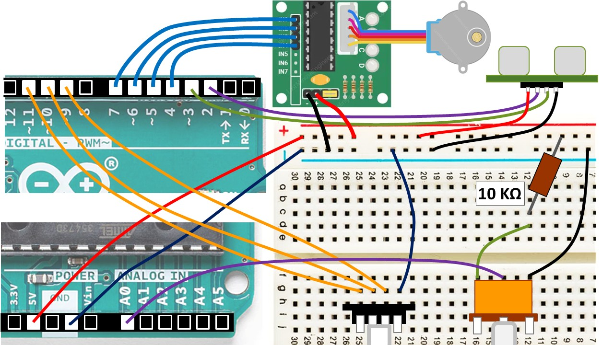

# Arduino Easter Project
Small Arduino project before Easter break

The following Arduino demonstration project is:
- reading ultrasonic distance sensor
- using and RGB LED module to show the distance (0cm: red ... 400cm: blue)
- driving a small stepper motor to rotate the "radar"
- reading a potentiometer to control the speed of the rotation

Please see the C source code in [arduino_radar.ino](arduino_radar.ino) and the sematics (also shown below) in [schema.jpg](schema.jpg).
Also feel free to use in the classroom a short presentation available in Hungarian ([arduino_radar_hu.pptx](arduino_radar_hu.pptx)).

## Schema

## License
Feel free to use it, Happy Easter! ;)

(in more official terms: BSD-3)
